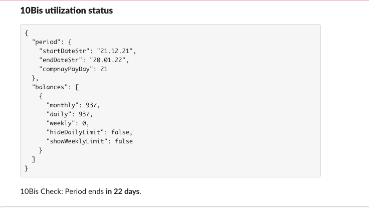

# home-scheduler
A useful set of scheduled jobs to use for your day to day life.

# jobs

## 10 bis period expiration notification
Notify when period is about to expire and suggest to by SufferSal credits.

)

# Slack bot
Listen to messages and execute commands.

# development
- Copy `.env.template` to `.env` and add your secrets
- Run compiler in watch mode using `npm run dev` 
- Develop your awosome schduled job
- Build docker image
```
docker build . -t pinhask/home-scheduler:latest --no-cache --platform linux/arm/v7
```
- Publish docker image
```
docker push pinhask/home-scheduler
```
- Run in docker everywhere
```
sudo docker run -dit --platform linux/arm/v7 -e TENBIS_USER_TOKEN=<token> -e SLACK_WEBHOOK=<your_hook_address> pinhask/home-scheduler
```

